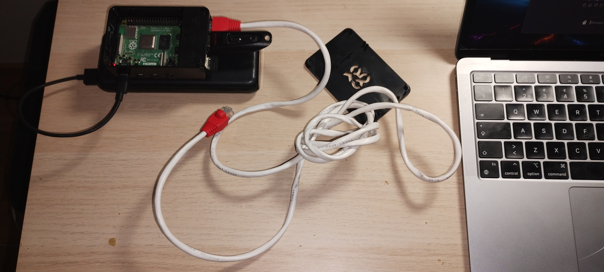
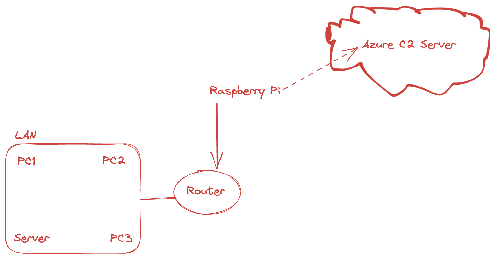

# Raspberrrypi_Pentest_Tool

### This repository's content is shared strictly for educational purposes, aimed at fostering understanding and development of defensive strategies against these kinds of potential cyber threats. The creator does not endorse nor encourage the misuse of this information in any manner. Responsibility for the use of this knowledge rests solely with the user. The creator assumes no liability for actions taken by others based on this content.

**What does it do? It's a gadget I built that sneaks into a local network and then phones home to my server. You might have seen it on "Hackad" – that Swedish TV show. They showed off the hardware. I figured that part out on my own, and you can see it in action in the episode I've linked below.**

Drawing inspiration from Episode 2 at timestamp: 13:37 ;) "Hackad" documentary featured on SVT Play. The particular episode that sparked this venture, "Kan man hacka en stad" https://www.svtplay.se/video/8M3RbJP/hackad/2-kan-man-hacka-en-stad?info=visa

#### Features:
**Custom Scripting:** At the heart of the toolkit lies two scripts tailored to download all the necessary tools, and another to connect back to the C2 server after internet connection has been established.

**LAN Testing Arsenal:** It's equipped with all the necessary tools for comprehensive LAN testing, ensuring you have everything you need at your fingertips.
  - Wireshark
  - Nmap
  - Metasploit
  - TcpDump
  - Ettercap
  - ARPScan
  - Aircrack-ng - (Need to buy a external WIFI-adapter that supports Monitor/AP mode) For potentially moving to other wireless networks around the Pi during pen-tests)

**C2 Connectivity:** Once integrated into the local network, the Pi establishes a covert channel back to the Command and Control (C2) server via an reverse shell, providing remote access and control to the pi.

**Enhanced Portability:** Unique to my version, the tool runs on a robust 20000mAh power bank, offering unparalleled flexibility and longer operational periods without the need for an external power source. (Aprox. 25Hours of battery life)




----------------------------------------
# Complete Setup Guide

## 1. Install Raspberry Pi OS and Download Scripts
- Begin by installing Raspberry Pi OS on your device.
- Download the scripts `callback.sh` and `rasptools.sh` to your Pi.

## 2. Make Scripts Executable
Make both scripts executable by running the following commands in your terminal:
- ```chmod +x ~/rasptools.sh```
- ```chmod +x ~/callback.sh```

- ```sudo ./rasptools.sh``` - to install the necessary tools
- **Before creating your service file and adding your ```callback.sh``` to it as shown in the step below. Make sure you change the IP and Port variables to your Public C2 Adress n Port.**


## 3. Create a Systemd Service for the callback Script
Set up a new systemd service to automate the execution of your callback script:
- ```sudo nano /etc/systemd/system/my_script.service```

Copy and paste the following configuration into the service file: **Remember to change "ExecStart=" to the path of your script**

```
[Unit]
Description=my_script.service
After=network-online.target

[Service]
Type=simple
ExecStart=~/pathtoyourscript/callback.sh
Restart=on-failure

[Install]
WantedBy=multi-user.target
```

## 4. Enable and Start the Service
Activate the service to ensure it runs on boot, and then start it immediately:
- ```sudo systemctl enable my_script.service```
- ```sudo systemctl start my_script.service```

**If you ever want to check the status of your service, just type:**
- ```sudo systemctl status my_script.service```

## 5. Start a netcat listener on your Azure C2. 
For this a simple azure vm is needed and it's pretty easy to setup. Just make sure you have the correct and neccessary nsg rules for the inbound connection on the desired port. 

**C2 Server**
- ```nc -lvnp 4444```

Now all you got to do is to restart the PI and try if the script runs on boot. You can try out the script manually also if you want to without restarting ```sudo chmod +x /callback.sh``` and then ``` sudo callback.sh``` without having reboot. But always make sure that it works on the reboot afterwards.


